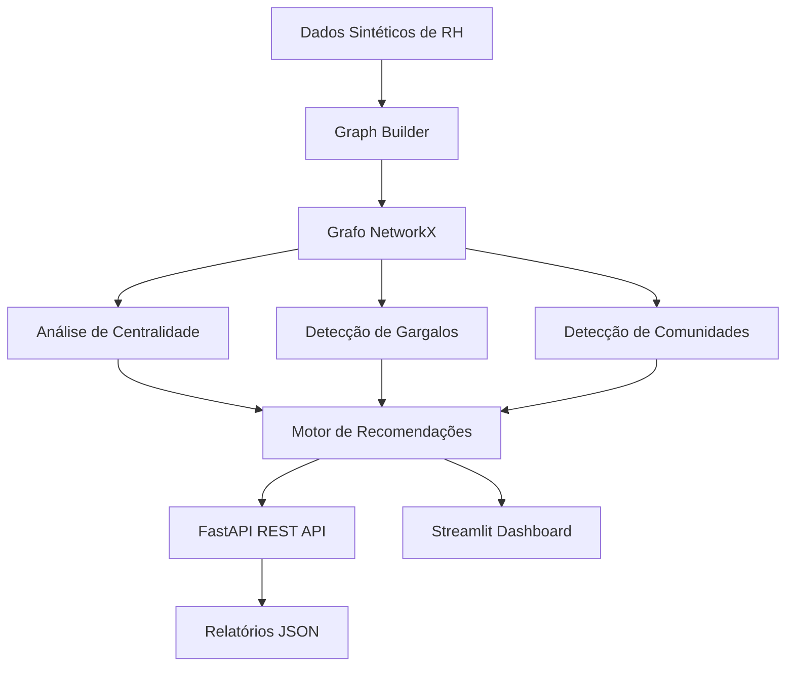
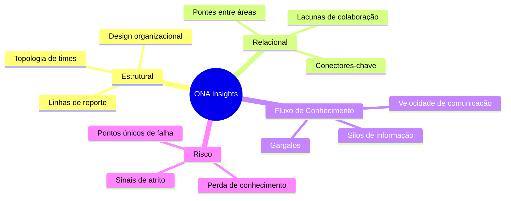
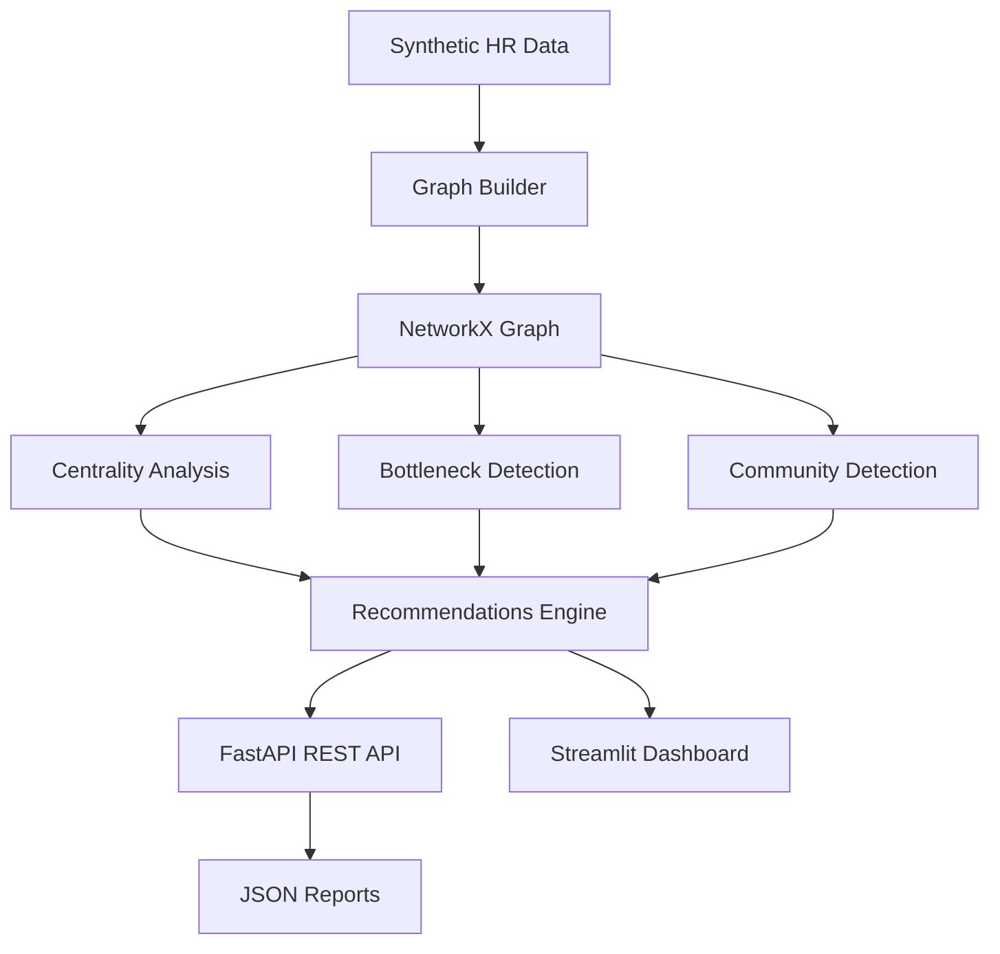
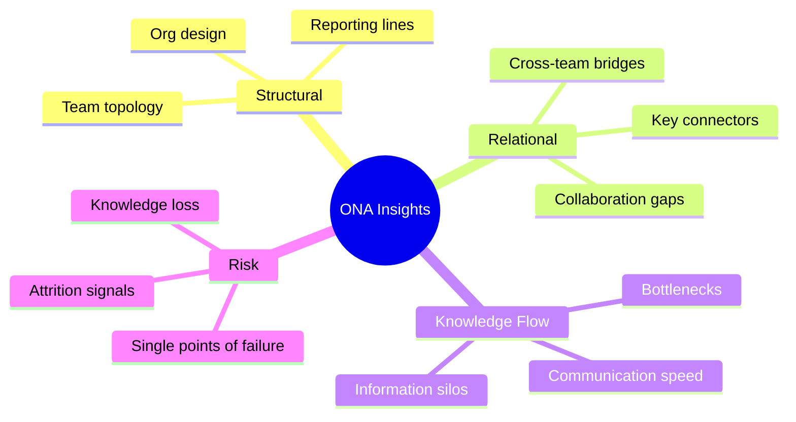

---

[Português](#português) | [English](#english)

---

# Português

## Análise de Redes Organizacionais (ONA) — Plataforma Completa

### Resumo Executivo

Plataforma de **Organizational Network Analysis (ONA)** para mapeamento de redes informais de comunicação dentro de organizações. Utiliza teoria dos grafos e detecção de comunidades para revelar a estrutura invisível que determina como a informação realmente flui — em contraste com o organograma formal.

O sistema gera dados sintéticos de colaboração (Slack, e-mail, reuniões), constrói grafos ponderados, calcula métricas de centralidade, detecta gargalos de informação, quantifica riscos de perda de conhecimento e produz recomendações executivas acionáveis.

### Problema de Negócio

Organizações perdem em média **US$ 12,9 milhões por ano** devido a falhas de colaboração e silos departamentais (McKinsey, 2023). A estrutura informal de comunicação — como as pessoas realmente trocam informação — raramente é analisada, apesar de ser o fator determinante para:

- **Velocidade de decisão**: a informação circula pelos caminhos reais, não pelos formais
- **Risco de atrito**: funcionários isolados têm 40% mais chance de deixar a empresa
- **Perda de conhecimento**: quando um "ponto único de falha" sai, leva conhecimento crítico consigo — custando 200% do salário anual em reposição (SHRM)
- **Inovação**: ocorre nas fronteiras entre departamentos; silos departamentais a sufocam

As redes informais **não correspondem ao organograma**. Conectores-chave e gargalos de informação são invisíveis sem análise de redes. Esta plataforma torna essas dinâmicas visíveis e acionáveis.

### Arquitetura





### Modelo de Dados

#### Funcionários (~200 registros)

| Campo          | Tipo  | Descrição                                  |
|----------------|-------|--------------------------------------------|
| `employee_id`  | str   | Identificador único (EMP-0001)             |
| `name`         | str   | Nome completo (sintético)                  |
| `department`   | str   | Engineering, Product, Sales, Marketing, HR, Finance, Operations, Legal |
| `seniority`    | str   | Junior, Mid, Senior, Lead, Director, VP    |
| `tenure_years` | float | Anos na empresa                            |
| `location`     | str   | HQ-SP, Remote-RJ, Remote-BH, Remote-CWB   |

#### Interações (~15.000+ registros)

| Campo       | Tipo | Descrição                        |
|-------------|------|----------------------------------|
| `source_id` | str  | Funcionário que iniciou a interação |
| `target_id` | str  | Funcionário que recebeu a interação |
| `channel`   | str  | slack, email, meeting            |
| `month`     | int  | Mês dentro da janela de análise  |
| `weight`    | int  | Contagem de interações (Poisson) |

### Metodologia

**Métricas de Teoria dos Grafos:**
- **Betweenness Centrality**: identifica intermediários de comunicação — quem está no caminho mais curto entre outros
- **Degree Centrality**: mede conectividade direta
- **Closeness Centrality**: mede velocidade de disseminação de informação
- **Clustering Coefficient**: mede coesão local ao redor de cada funcionário

**Detecção de Comunidades:**
- Algoritmo de Louvain para maximização de modularidade
- Resolução configurável para ajuste de granularidade
- Identificação de comunidades cross-departamentais

**Score Composto de Risco:**
```
bottleneck_score = betweenness_rank × (1 - clustering_coefficient)
knowledge_risk  = 0.5 × betweenness_rank + 0.3 × (tenure / max_tenure) + 0.2 × degree_rank
```

Categorias: **CRITICAL** (top 5%) | **HIGH** (top 20%) | **MODERATE** (top 40%) | **LOW**

### Resultados-Chave (Exemplo)

```
Resumo da Análise ONA
━━━━━━━━━━━━━━━━━━━━━━━━━━━━━━━━━━━━━━━━━━
Rede: 200 nós, ~8.400 arestas
Densidade: 0.034
Comunidades detectadas: 7 (Modularidade: 0.42)

GARGALOS DETECTADOS: 12
  ► CRITICAL (score >= 0.70): 3 funcionários
  ► HIGH: 9 funcionários

RISCO DE CONHECIMENTO:
  ► CRITICAL: 4 funcionários | HIGH: 12 | MODERATE: 18

COMUNIDADES CROSS-DEPARTAMENTAIS: 4 de 7

RECOMENDAÇÕES PRIORITÁRIAS:
  [HIGH] Transferência de Conhecimento: funcionários críticos em Engineering
  [HIGH] Quebra de Silo: Finance tem apenas 18% de conexões cross-departamento
  [MEDIUM] Planejamento de Sucessão: 4 funcionários em risco crítico
```

### Limitações

- **Dados sintéticos**: calibração com dados reais é necessária antes de deploy em produção
- **Snapshot estático**: a análise captura um período fixo, sem dinâmica temporal contínua
- **Sem análise de sentimento**: considera frequência de interação, não qualidade ou conteúdo
- **Detecção probabilística**: resultados de comunidades variam com seeds aleatórios
- **Proxy de conhecimento**: o score de risco não modela o conteúdo real do conhecimento

### Considerações Éticas

Análise de redes organizacionais, se aplicada a dados reais, exige cuidados rigorosos:

1. **Consentimento informado**: funcionários devem saber que metadados de comunicação são analisados
2. **Minimização de dados**: apenas padrões agregados, nunca conteúdo de mensagens individuais
3. **Sem vigilância**: ONA deve informar design organizacional, não monitorar indivíduos
4. **Direito à desconexão**: comunicação fora do horário deve ser excluída da análise
5. **Conformidade LGPD/GDPR**: metadados de comunicação são dados pessoais sob legislação de proteção de dados
6. **Anti-discriminação**: resultados não devem ser usados para fins disciplinares ou avaliativos
7. **Participação sindical**: em muitas jurisdições, análise de dados de funcionários requer aprovação de conselho trabalhista

**Casos de uso recomendados (éticos):**
- Identificar oportunidades de redesign organizacional
- Desenhar projetos cross-funcionais
- Suporte a onboarding (conectar novos funcionários a conectores-chave)
- Detectar potencial burnout em conectores sobrecarregados (para oferecer suporte, não penalizar)

### Como Executar

#### Setup Local

```bash
git clone https://github.com/galafis/org-network-analysis-ona.git
cd org-network-analysis-ona

python -m venv .venv
source .venv/bin/activate  # Windows: .venv\Scripts\activate

make install           # Instala dependências
make data              # Gera dados sintéticos
make analyze           # Executa análise completa
make run-api           # API em http://localhost:8000/docs
make run-ui            # Dashboard em http://localhost:8501
```

#### Docker

```bash
docker compose up --build -d

# API:       http://localhost:8000/docs
# Dashboard: http://localhost:8501
```

### Pontos para Entrevista

> "Apliquei teoria dos grafos a um domínio que a maioria dos cientistas de dados ignora — análise de redes organizacionais. Em vez de analisar dados de clientes, virei a lente para a própria organização. Usando betweenness centrality, consigo identificar quem é um gargalo de comunicação antes que sofra burnout ou peça demissão. Usando detecção de comunidades Louvain, encontro clusters naturais que não correspondem ao organograma. Isso tem valor de negócio direto: cada evento de perda de conhecimento crítico custa 50-200% do salário anual do funcionário."

**Conceitos-chave demonstrados:**
- Betweenness centrality vs. degree centrality (por que medem coisas diferentes)
- Por que alta betweenness + baixo clustering é o padrão mais perigoso de gargalo
- Algoritmo Louvain: o que otimiza (modularidade), o que o parâmetro de resolução controla
- Como a densidade da rede se relaciona com a velocidade do fluxo de informação
- A tensão ética entre insights de ONA e privacidade dos funcionários

### Posicionamento no Portfólio

**Por que este projeto diferencia:**
- ONA é utilizado por equipes de HR Tech de Fortune 500, mas raramente aparece em portfólios de data science
- Demonstra teoria dos grafos aplicada a negócios — uma combinação rara de habilidades
- Mostra pensamento full-stack: geração de dados → análise de grafos → API REST → dashboard → relatório executivo
- Seção de considerações éticas demonstra maturidade e consciência de desafios de implantação real

### Impacto de Negócio

| Insight ONA | Impacto de Negócio | Valor Estimado |
|-------------|-------------------|----------------|
| Identificar gargalo crítico antes de burnout | Prevenir perda de produtividade de R$ 2,5M+ | Por funcionário-chave |
| Sinalizar risco CRITICAL de conhecimento | Reduzir time-to-productivity do substituto em 40% | Por funcionário crítico |
| Quebrar silo entre Engineering e Sales | Ciclos de venda 15-25% mais rápidos | Por trimestre |
| Proteger conectores-chave | Reduzir risco de fragmentação organizacional | Nível de rede |
| Identificação precoce de riscos de atrito | Economia de R$ 10-25M/ano para empresas de médio porte | Anual |

### Conexão com HR Tech

Produtos que utilizam abordagem similar:
- **TOTVS RH People Analytics** — módulo de análise de redes de colaboração
- **Microsoft Viva Insights** — análise de padrões de colaboração no Microsoft 365
- **Workday Peakon** — identificação de riscos de atrito via padrões comportamentais
- **SAP SuccessFactors** — workforce analytics e planejamento de sucessão
- **OrgMapper / TrustSphere** — ferramentas especializadas em ONA corporativo

---

# English

## Organizational Network Analysis (ONA) — Full Platform

### Executive Summary

An **Organizational Network Analysis (ONA)** platform for mapping informal communication networks within organizations. Leverages graph theory and community detection to reveal the invisible structure that determines how information actually flows — in contrast with the formal org chart.

The system generates synthetic collaboration data (Slack, email, meetings), builds weighted graphs, computes centrality metrics, detects information bottlenecks, quantifies knowledge loss risks, and produces actionable executive recommendations.

### Business Problem

Organizations lose an average of **$12.9 million per year** due to collaboration failures and departmental silos (McKinsey, 2023). The informal communication structure — how people actually exchange information — is rarely analyzed, despite being the determining factor for:

- **Decision speed**: information flows through real paths, not formal ones
- **Attrition risk**: isolated employees are 40% more likely to leave
- **Knowledge loss**: when a "single point of failure" departs, they take critical knowledge — costing 200% of annual salary in replacement (SHRM)
- **Innovation**: happens at the boundaries between departments; silos suffocate it

Informal networks **do not match the org chart**. Key connectors and information bottlenecks are invisible without network analysis. This platform makes those dynamics visible and actionable.

### Architecture





### Data Model

#### Employees (~200 records)

| Field          | Type  | Description                                    |
|----------------|-------|------------------------------------------------|
| `employee_id`  | str   | Unique identifier (EMP-0001)                   |
| `name`         | str   | Full name (synthetic)                          |
| `department`   | str   | Engineering, Product, Sales, Marketing, HR, Finance, Operations, Legal |
| `seniority`    | str   | Junior, Mid, Senior, Lead, Director, VP        |
| `tenure_years` | float | Years at the company                           |
| `location`     | str   | HQ-SP, Remote-RJ, Remote-BH, Remote-CWB       |

#### Interactions (~15,000+ records)

| Field       | Type | Description                          |
|-------------|------|--------------------------------------|
| `source_id` | str  | Employee who initiated the interaction |
| `target_id` | str  | Employee who received the interaction  |
| `channel`   | str  | slack, email, meeting                |
| `month`     | int  | Month within the analysis window     |
| `weight`    | int  | Interaction count (Poisson-distributed) |

### Methodology

**Graph Theory Metrics:**
- **Betweenness Centrality**: identifies communication intermediaries — who lies on the shortest paths between others
- **Degree Centrality**: measures direct connectivity
- **Closeness Centrality**: measures information dissemination speed
- **Clustering Coefficient**: measures local cohesion around each employee

**Community Detection:**
- Louvain algorithm for modularity maximization
- Configurable resolution for granularity adjustment
- Cross-departmental community identification

**Composite Risk Scoring:**
```
bottleneck_score = betweenness_rank × (1 - clustering_coefficient)
knowledge_risk  = 0.5 × betweenness_rank + 0.3 × (tenure / max_tenure) + 0.2 × degree_rank
```

Categories: **CRITICAL** (top 5%) | **HIGH** (top 20%) | **MODERATE** (top 40%) | **LOW**

### Key Results (Example)

```
ONA Analysis Summary
━━━━━━━━━━━━━━━━━━━━━━━━━━━━━━━━━━━━━━━━━━
Network: 200 nodes, ~8,400 edges
Density: 0.034
Communities detected: 7 (Modularity: 0.42)

BOTTLENECKS DETECTED: 12
  ► CRITICAL (score >= 0.70): 3 employees
  ► HIGH: 9 employees

KNOWLEDGE RISK:
  ► CRITICAL: 4 employees | HIGH: 12 | MODERATE: 18

CROSS-DEPARTMENT COMMUNITIES: 4 of 7

TOP RECOMMENDATIONS:
  [HIGH] Knowledge Transfer: critical employees in Engineering
  [HIGH] Break Silo: Finance has only 18% cross-department connections
  [MEDIUM] Succession Planning: 4 employees at critical risk
```

### Limitations

- **Synthetic data**: calibration with real data is required before production deployment
- **Static snapshot**: the analysis captures a fixed period, without continuous temporal dynamics
- **No sentiment analysis**: considers interaction frequency, not quality or content
- **Probabilistic detection**: community detection results vary with random seeds
- **Knowledge proxy**: the risk score does not model actual knowledge content

### Ethical Considerations

Organizational network analysis, if applied to real data, requires rigorous safeguards:

1. **Informed consent**: employees must know that communication metadata is being analyzed
2. **Data minimization**: only aggregate patterns, never individual message content
3. **No surveillance**: ONA should inform organizational design, not monitor individuals
4. **Right to disconnect**: after-hours communication should be excluded from analysis
5. **LGPD/GDPR compliance**: communication metadata is personal data under data protection laws
6. **Anti-discrimination**: results must not be used for disciplinary or evaluative purposes
7. **Worker council involvement**: in many jurisdictions, employee data analytics requires labor council approval

**Recommended use cases (ethical):**
- Identifying structural redesign opportunities
- Designing cross-functional projects
- Onboarding support (connecting new employees to key connectors)
- Detecting potential burnout in overloaded connectors (to offer support, not penalize)

### How to Run

#### Local Setup

```bash
git clone https://github.com/galafis/org-network-analysis-ona.git
cd org-network-analysis-ona

python -m venv .venv
source .venv/bin/activate  # Windows: .venv\Scripts\activate

make install           # Install dependencies
make data              # Generate synthetic data
make analyze           # Run full analysis
make run-api           # API at http://localhost:8000/docs
make run-ui            # Dashboard at http://localhost:8501
```

#### Docker

```bash
docker compose up --build -d

# API:       http://localhost:8000/docs
# Dashboard: http://localhost:8501
```

### Interview Talking Points

> "I applied graph theory to a domain most data scientists ignore — organizational network analysis. Instead of analyzing customer data, I turned the lens on the organization itself. Using betweenness centrality, I can identify who is a communication bottleneck before they burn out or leave. Using Louvain community detection, I can find natural clusters that don't match the org chart. This has direct business value: every critical knowledge-loss event costs companies 50-200% of an employee's annual salary in recruitment, onboarding, and productivity loss."

**Key concepts demonstrated:**
- Betweenness centrality vs. degree centrality (why they measure different things)
- Why high betweenness + low clustering is the most dangerous bottleneck pattern
- Louvain algorithm: what it optimizes (modularity), what the resolution parameter does
- How network density relates to information flow speed
- The ethical tension between ONA insights and employee privacy

### Portfolio Positioning

**Why this project differentiates:**
- ONA is used by Fortune 500 HR Tech teams but rarely appears in data science portfolios
- Demonstrates graph theory applied to business — a rare skill combination
- Shows full-stack thinking: data generation → graph analysis → REST API → dashboard → executive report
- Ethical considerations section demonstrates maturity and awareness of real-world deployment challenges

### Business Impact

| ONA Insight | Business Impact | Estimated Value |
|-------------|----------------|-----------------|
| Identify critical bottleneck before burnout | Prevent $500K+ productivity loss | Per key employee |
| Flag CRITICAL knowledge risk before departure | Reduce time-to-productivity for replacement by 40% | Per critical employee |
| Break engineering/sales silo | 15-25% faster deal cycles | Per quarter |
| Protect key connectors | Reduce organizational fragmentation risk | Network-level |
| Early identification of attrition risks | Save $2-5M/year for mid-size companies | Annual |

### HR Tech Connection

Products using a similar approach:
- **TOTVS RH People Analytics** — collaboration network analysis module
- **Microsoft Viva Insights** — collaboration pattern analysis on Microsoft 365
- **Workday Peakon** — attrition risk identification via behavioral patterns
- **SAP SuccessFactors** — workforce analytics and succession planning
- **OrgMapper / TrustSphere** — specialized corporate ONA tools

---

### Project Structure

```
org-network-analysis-ona/
├── src/
│   ├── config/settings.py          # Pydantic BaseSettings
│   ├── data/generator.py           # Synthetic org data generator
│   ├── network/
│   │   ├── graph_builder.py        # NetworkX graph construction
│   │   └── centrality.py           # Centrality metrics computation
│   ├── analysis/
│   │   ├── bottleneck.py           # Bottleneck + knowledge risk detection
│   │   ├── community.py            # Louvain community detection
│   │   ├── recommendations.py      # Executive recommendation engine
│   │   └── runner.py               # Full analysis orchestrator
│   ├── reporting/report_generator.py # JSON + HTML report export
│   ├── api/                        # FastAPI (main, routes, schemas)
│   └── dashboard/app.py            # Streamlit interactive dashboard
├── tests/                          # pytest suite
├── docs/                           # Architecture + data dictionary
├── docker/                         # Dockerfile.api + Dockerfile.dashboard
├── docker-compose.yml
├── Makefile
└── requirements.txt
```

---

**Author:** Gabriel Demetrios Lafis — [github.com/galafis](https://github.com/galafis)

**License:** MIT
