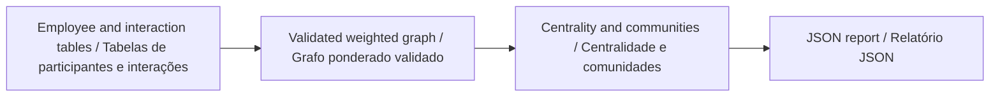

# Organizational Network Analysis

### Análise de Redes Organizacionais

[](https://github.com/galafis/org-network-analysis-ona/actions/workflows/ci.yml)
[English](#english) · [Português](#portugues) · [Examples / Exemplos](examples/review_demo.py) · [Validation / Validação](docs/VALIDATION.md)

**Network science / Ciência de redes** · Working prototype / Protótipo funcional · Gabriel Demetrios Lafis

<a id="english"></a>

## English

Build weighted collaboration graphs from employee and interaction tables, then examine centrality, communities, disconnected groups and cross-department relationships.

### What works

- Directed and undirected graphs; reverse interactions aggregate without losing fractional weights.
- Centrality, community analysis, bottleneck heuristics and JSON reporting are implemented in separate modules.
- Explicit input contracts reject unknown employees, self-interactions and nonpositive or nonfinite weights.

### Reproducible walkthrough

Requirements: Python 3.12 / Python 3.12.

Run from the repository root. The validation environment installs the components exercised by the tests and documented example; optional integrations may need their separate dependencies.

```sh
python -m venv .venv
# Activate .venv for your shell / Ative .venv no seu terminal
python -m pip install -r requirements-validation.txt
python -m pytest -q
python -m examples.review_demo
```

**Input contract / Contrato de entrada:** `employee_id`; `source_id`, `target_id`, `weight`.

**Expected behavior / Comportamento esperado:** 4 nodes, 2 edges, 2 connected components; A–B weight = 0.75. / 4 nós, 2 arestas, 2 componentes conexos; peso A–B = 0,75.

### Architecture / Arquitetura



The main path can be followed in [src/network/graph_builder.py](src/network/graph_builder.py). Examples call the actual implementation and include assertions; they are not pseudocode.

### Scope and assumptions

The example is synthetic. Network centrality is not a measure of employee worth or productivity. No employee monitoring system or causal inference is demonstrated.

### Changes verified in this review

Preserved fractional edge weights; fixed statistics for an explicitly supplied empty graph; added endpoint and weight validation.

<a id="portugues"></a>

## Português

Construa grafos ponderados de colaboração a partir de tabelas de participantes e interações e examine centralidade, comunidades, grupos desconectados e relações entre departamentos.

### Funcionalidades disponíveis

- Grafos direcionados e não direcionados; interações inversas são agregadas sem perder pesos fracionários.
- Centralidade, análise de comunidades, heurísticas de gargalos e relatórios JSON são implementados em módulos separados.
- Contratos de entrada rejeitam participantes desconhecidos, auto-interações e pesos não positivos ou não finitos.

### Execução reproduzível

Use os comandos da seção acima a partir da raiz do repositório. Requisitos: Python 3.12 / Python 3.12. O ambiente de validação instala os componentes exercitados pelos testes e pelo exemplo documentado; integrações opcionais podem exigir dependências próprias.

O fluxo principal está em [src/network/graph_builder.py](src/network/graph_builder.py). Os exemplos usam a implementação real e verificam resultados com asserções; não são pseudocódigo. O diagrama apresenta os mesmos passos nos dois idiomas.

### Escopo e premissas

O exemplo é fictício. Centralidade não mede valor ou produtividade de pessoas. O projeto não demonstra um sistema de monitoramento de funcionários nem inferência causal.

### Melhorias verificadas nesta revisão

Preservados pesos fracionários; corrigidas estatísticas de grafo vazio informado explicitamente; adicionada validação de participantes e pesos.

### Run the application / Executar a aplicação

```sh
python -m uvicorn src.api.main:app --host 127.0.0.1 --port 8000
```

## Repository guide / Guia do repositório

| Location / Local                                               | Purpose / Finalidade                                                   |
| -------------------------------------------------------------- | ---------------------------------------------------------------------- |
| [Implementation / Implementação](src/network/graph_builder.py) | Main domain behavior / Comportamento principal do domínio              |
| [Example / Exemplo](examples/review_demo.py)                   | Executable scenario / Cenário executável                               |
| [Tests / Testes](tests/)                                       | Normal behavior and failure cases / Fluxos válidos e casos de falha    |
| [Validation notes / Notas de validação](docs/VALIDATION.md)    | Corrections, evidence and boundaries / Correções, evidências e limites |
| [Workflow / Automação](.github/workflows/ci.yml)               | Automated checks / Verificações automatizadas                          |

- [Executed example result / Resultado executado do exemplo](examples/expected.json)

## Development / Desenvolvimento

EN: When changing behavior, update the contract, the worked example and a regression test together. Keep synthetic fixtures separate from real data. A passing test suite demonstrates the listed software behaviors; it does not certify a deployment or domain outcome.

PT: Ao alterar comportamento, atualize em conjunto o contrato, o exemplo e um teste de regressão. Separe amostras fictícias de dados reais. Testes aprovados demonstram os comportamentos de software listados; não certificam implantação nem resultado no domínio.

Author / Autor: [Gabriel Demetrios Lafis](https://github.com/galafis) · [Institutional contact / Contato institucional](mailto:gabrieldemetrioslafis@usp.br)

License / Licença: [repository license](LICENSE).
